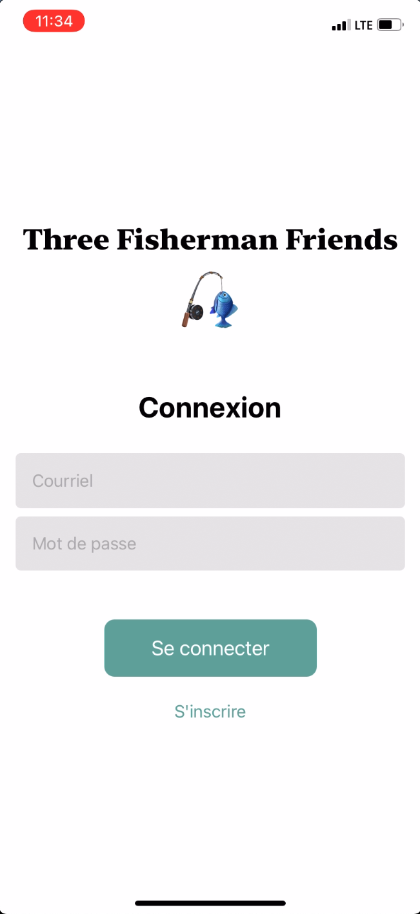
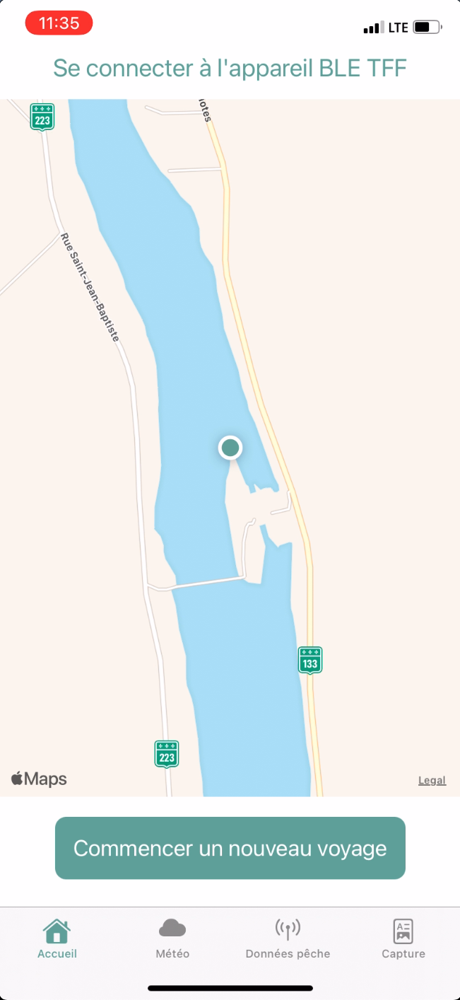
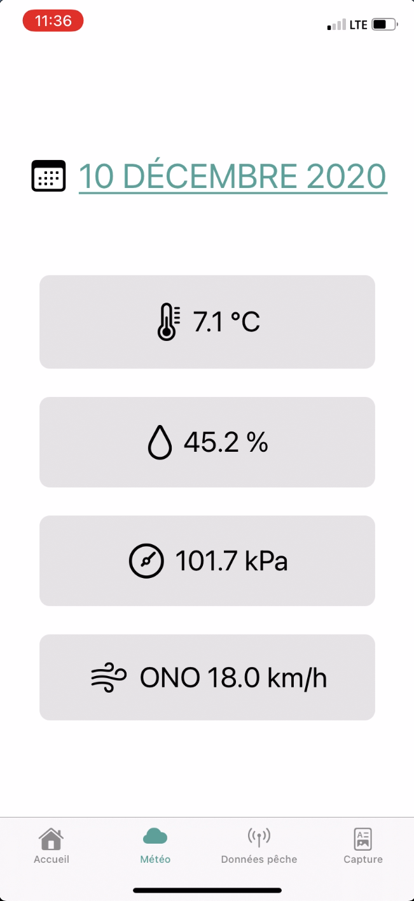
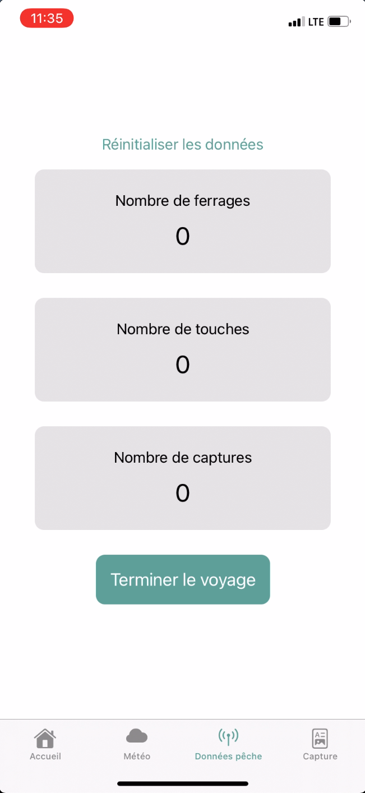
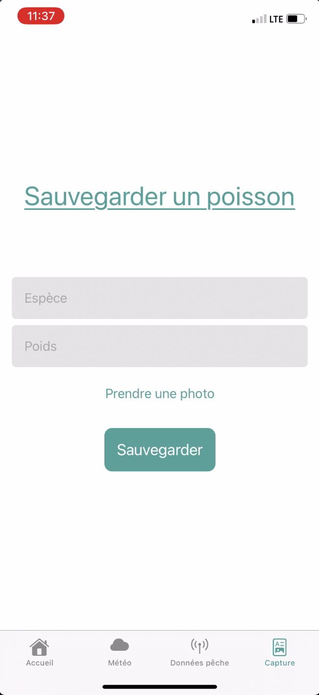

# TFF-Project
## Concept
Projet du cours IoT (Internet of Things) qui consistait à faire un projet IoT reliant micro-contrôleur, site web et application mobile. Voici le code de l'application mobile ainsi que le script du micro-contrôleur Arduino codé avec le langage C++ s'y rattachant. Le code du site web et de l'API se retrouve dans le repo commun avec mes coéquipiers.

L'application mobile permet de faire des voyages de pêche, et lorsque connecter avec le micro-contrôleur, de collecter les différentes données météorologiques (physiques du micro-contrôleur: "température, taux d'humidité, pression barométrique", données GPS: "localisation, vent") lors d'une capture de poisson, ainsi que les différentes métriques de la canne à pêche (ferrages, touches) grâce à un capteur de vibration et un accéléromètre. Cela s'envoit à notre base de données lorsque l'utilisateur indique que le voyage est finit et ensuite il peut aller accéder à ses informations à l'aide du site web.

## Media(s)
### Login

### Map

### Les données météorologiques

### Statistiques de pêche

### Sauvegarder une capture

## Technologies
- iOS / Xcode / Swift / SwiftUI
- Arduino
- Appels API REST PHP
- Base de données Relationnelle

